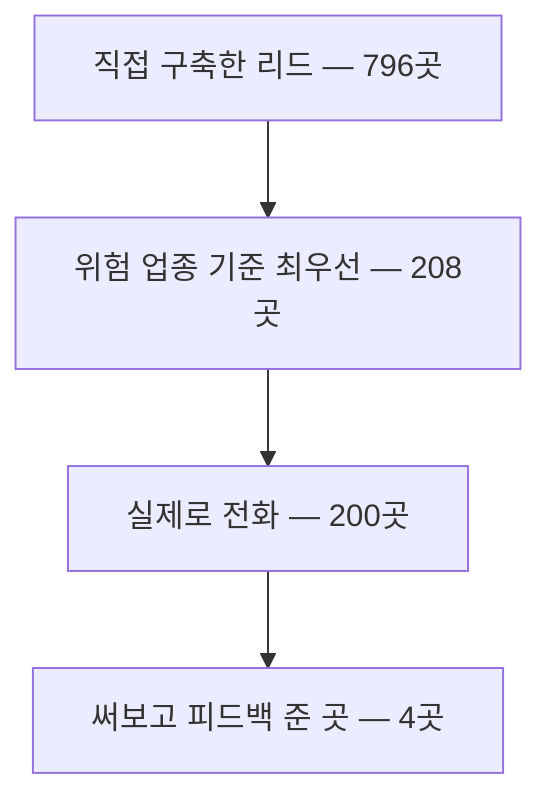

중대재해처벌법 의무 이행을 문서로 전수 점검하고 소명자료 초안까지 뽑아주는 에이전트
**세이프티 가디언**을 2주 만에 만들었고, 200곳에 전화를 걸어 4곳한테 실사용 피드백을
받았다. 중간 발표에서 잘했다는 평을 들었는데, 기분이 이상했다. 그 얘기다.

## 사실은 파이널 연습이었다

강사님은 실제 사용을 엄청 중요시하셨다. 기업이랑 연계가 되면 파이널 때 무조건
우승이라고. 그 말을 듣고 중간 프로젝트의 목표를 그렇게 잡았다 — 잘 만드는 게 아니라,
**실제로 쓰게 만드는 연습.** 중간 프로젝트는 사실 파이널 연습이었다.

주제는 ERP·법률·미국 법률을 놓고 비교하다가 중대재해처벌법으로 갔다. 이 법은 사고가
아니라 절차로 처벌한다. 사고를 막았느냐가 아니라 **체계를 갖췄다는 걸 증명했느냐**를
묻는다. 그래서 만든 게 세이프티 가디언이다 — 회사가 현장 문서를 올리면 법의 의무
16개를 하나하나 대조해서 뭐가 증빙됐고 뭐가 비었는지 보여주고, 소명자료 초안까지
만들어준다.

 처음 열면 **"아직 점검된 의무가 없습니다"** — 게이지가 0이다. 여기에 현장 문서를 올리면 16개 의무가 하나씩 판정되면서 게이지가 차오른다.

 **판정이 다 끝나기 전에는 소명자료가 한 글자도 안 써진다.** 세 노드를 한 줄로 물려서 순서를 코드가 붙잡게 했다 — 진단을 건너뛰고 초안부터 뽑는 경로는 이 그래프에 아예 없다.

## 3일 안에 MVP, 하루 만의 피벗

계획은 단순했다. 3일 안에 MVP를 끝내고, 남은 시간은 전부 전화에 쓴다. 첫 3일은
주말이라 거의 혼자 달렸다.

첫날 합성 데이터부터 RAG·분류기·LangGraph·프론트까지 골격을 다 세웠는데, 둘째 날
그걸 거의 뒤집었다. 원래는 합성 기업 60개 중 하나를 골라 채팅하는 데모였다. 근데
실제 고객이 쓰는 장면을 생각해보니 그게 아니었다 — 고객사는 하나고, 채팅이 아니라
문서를 올린다. 그리고 "법을 완벽하게 고려했다"는 보장은 RAG 유사도 검색으로는 못
한다. 그래서 법 조문을 사람이 검수한 **고정 체크리스트 16개**로 만들어 문서와
하나하나 대조하는 구조로 바꿨다. 숫자랑 조문은 모델이 지어낼 여지가 없게
결정론적으로 조립했다.

 문서를 올리고 나면 이 화면에서 **종합 리스크 진단**과 **소명자료 초안**이 나온다. 판정이 끝난 의무는 다시 감사하지 않고 초안만 뽑는다.

 모델은 판정과 인용문까지만 낸다. 그 인용문이 실제로 들어 있는 문서는 코드가 원문을 훑어 찾는다 — **어느 문서에서 나온 근거인지는 모델한테 묻지 않는다.**

## 전화 200통

개발보다 이게 본체였다. 광주권 제조업 위주로 리드 796곳을 만들고, 셋이서 일주일
동안 미친 듯이 걸었다. 한 사람당 60통쯤. 그중 4곳이 실제로 써보고 피드백을 줬다.

제일 신기했던 통화가 있다. 우리는 보안 걱정 때문에 목데이터 문서를 주면서 "이거
넣어보고 봐만 달라"고 했다. 근데 한 제조 회사 담당자는 그냥 자기 회사 법률·ERP
문서를 직접 집어넣더라. 보안 위험이 있을 텐데. **그게 너무 신기했다.** 써봐달라고
조르는 단계를 건너뛰고, 필요한 사람은 그냥 쓴다.

황당한 통화도 있었다. 무슨 자기 회사를 위해 만들어줬어야 하는 것마냥 나한테 화를
내는 분이 있었다. 하청을 맡긴 것도 아니고. 어이가 없어서 역으로 화내고 끊었다.

피드백은 두 개가 남았다. "업로드가 너무 오래 걸린다" — 서버가 없어서다. 학생 팀의
한계를 그대로 맞았다. "관련 없는 문서도 미이행으로 뜬다" — 증거 없음과 의무 위반을
구분 안 한 프롬프트 문제였고, 바로 고쳤다.

 전화로 알려주던 데모 주소가 붙어 있던 기계다. 공유 CPU 한 개에 메모리 2GB, 상시 켜두는 한 대. **의무 16개 판정이 도는 2분 남짓을 매 업로드마다 이 위에서 견뎠다.**

숫자 하나가 더 남았다. 조사한 800곳 중 이메일이 확인되는 곳이 80곳. 처벌받는
회사들이 정작 디지털 접점이 제일 없는 회사들이었다. 그리고 안전 전문 직원이 이미
있는 회사일수록 우리 걸 안 쓰려고 했다.

## 토큰 1/30

강사님이 토큰 가성비를 되게 중요시하셨다. 그래서 작업을 둘로 쪼갰다 — 틀리면
보고서가 뒤집히는 **판단**과, 이미 끝난 판단을 옮겨 쓰는 **작성**. 판단은 Claude,
작성은 DeepSeek로 두고 실제 프로덕션 프롬프트로 직접 비교표를 만들었는데, 싼 모델이
대등했다. 그래서 Claude를 제품에서 들어냈다. 출력 토큰 비용이 1/30이 됐다.

 **Claude를 들어낸 뒤에도 이 표는 안 지웠다.** 모델을 고르려고 그었던 경계선이 지금은 어느 쪽에 추론을 켤지를 가른다. 모델은 갈아탔는데 그 모델 때문에 만든 구분만 남아서 다른 일을 하고 있는 셈이다.

## 발표, 그리고 과장

발표는 아침 세 번째 순서였다. 자료도 대본도 직전에야 다 썼고, PPT는 전부
자동생성이었다. 지금 봐도 되게 못 만들었다. 그래도 내용이 좋아서 발표는 잘 맞았고,
강사님은 제일 잘했다고 하셨다. "지우처럼만 해라"라고 말하고 다니신다더라.

근데 발표에서 숫자 둘을 부풀렸다. 실사용 4곳을 10곳이라 했고, 토큰 1/30을 1/50이라
했다. 역할 분담 슬라이드도 실제랑 달랐다 — 개발은 거의 내가 했다. 발표 끝나고
일기에 "강사님을 속여서 좋은 평가를 받은 기분"이라고 썼는데, 지금 정리하면 이런
거다. **프로젝트를 했다기보다 심사위원이 원하는 걸 했다는 느낌.**

이상한 건, 강사님이 원한 건 실제 사용이었고 그건 진짜로 했다는 거다. 전화 200통은
연기가 아니다. 과장 없이 그대로 발표했어도 결과는 다르지 않았을 거 같다.
**근데 그게 계속 걸린다**. 잘 모르겠다.

## 남은 것

깡을 배웠다. **전화 막 걸면서 써봐달라고 하는 게 제일 좋더라.** 파이널에서도 그대로
할 거다. 발표 준비는 더 길게 할 거고. 같이 일해보니 누구랑 맞고 누구랑 안 맞는지도
알게 됐다 — 이건 여기까지만 적는다.

> He who is not very strong in memory should not meddle with lying.
> — Michel de Montaigne, *Essays*
